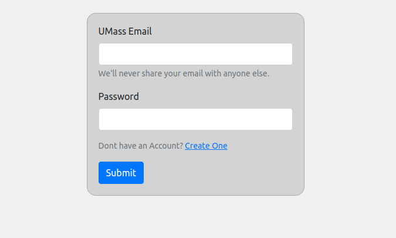
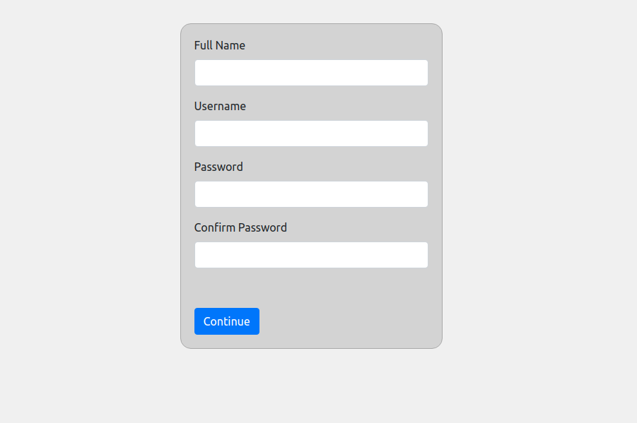
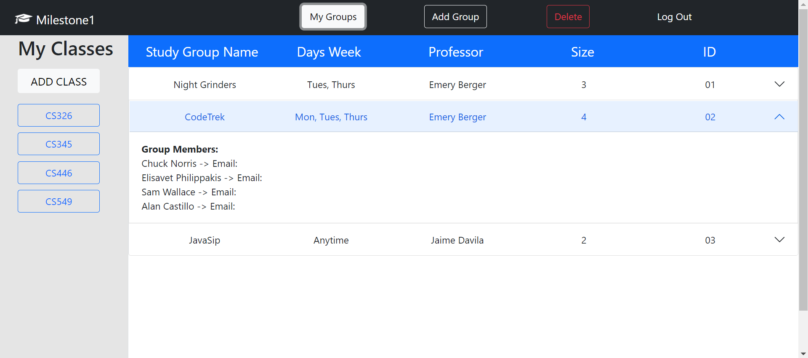
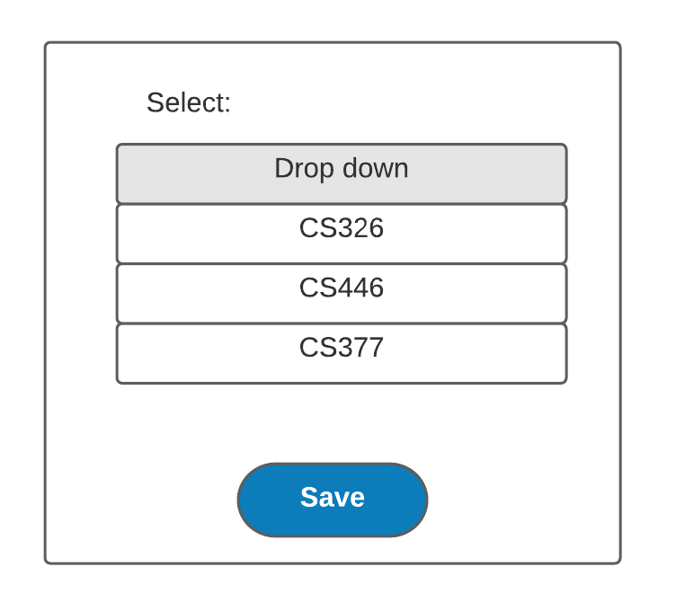
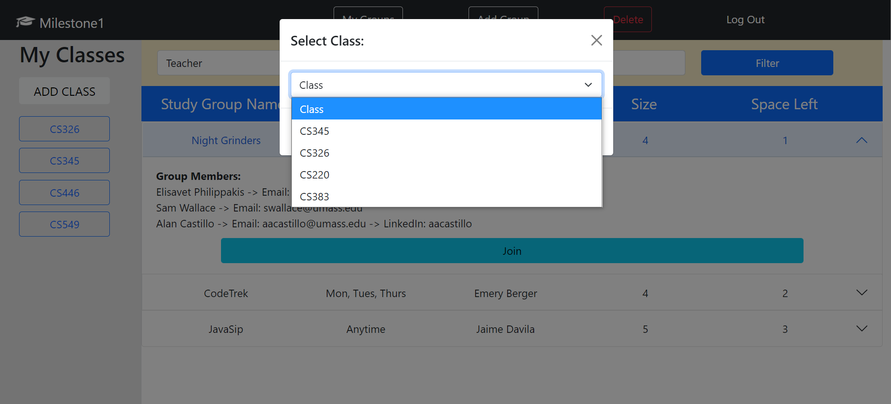
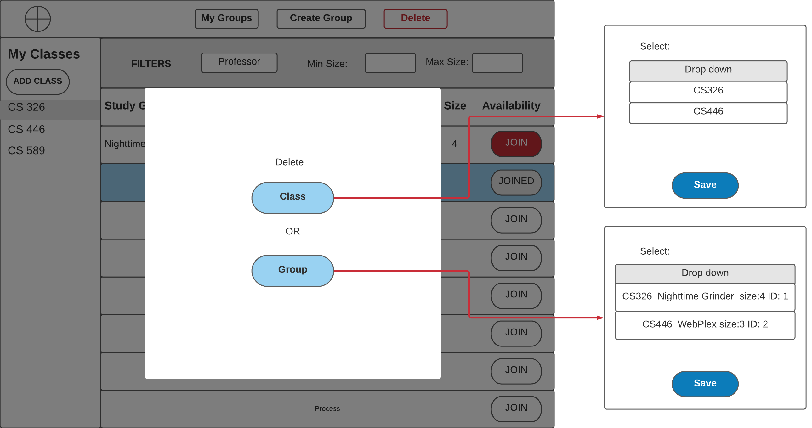
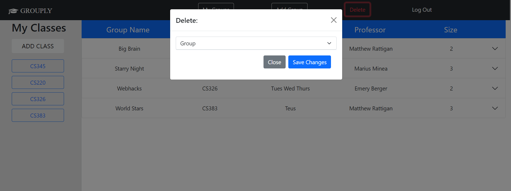

**User Interactions**

Our application enables classmates to interact with each other by joining student-made, student-run study groups with specified meeting times, meeting locations, and group sizes. The user begins their interaction with creating an account, where they will credentials in the form of a UMass email and a password. Then, they have the option to specify any personal information which they wish to share with other users on the site and members of groups that they are in - these are noted on the login screen as personal info and displayed info, respectively. Personal info consists of the user's phone number, Linkedin profile, and Snapchat handle. The Displayed information conatins your major, and a small bio. Once an account is made, the user is taken to the home screen where they must add their classes to the view before they can join or create groups. When adding a class, they are presented with a list of all available classes to add - this class data is loaded using the javascript. Once they add a class, their home screen is populated with a list of groups that they can join for the class selected on the left panel. After they join some groups, those joined groups will remain at the top of this list. Each list entry specifies the group name, the days of the week the group meets, the professor of that section of the class, the maximum size of the group, and the group ID (important for deleting a group). If they want to create their own group, they can press the "Create Group" button on the top to specify all of this information themselves ad add their new group to the list. When a group in the list is clicked on, its entry expands to showthe group's members and their public information. They can also delete their created groups by specifying the ID of a group they created in a pop-up modal.

Below are all of the frames with their respectiv wireframes and html implementations:

**Login/Create Account Page (Wireframe)**

**Login Page (HTML)**

**Create Account Page 1 (HTML)**

**Create Account Page 2 (HTML)**

**Home Page/My Groups (Wireframe)**

**Home Page/My Groups (HTML)**

**Join a Group (Wireframe)**

**Join a Group (HTML)**

**Add Class Modal (Wireframe)**

**Add Class Modal (HTML)**

**Create Group Modal (Wireframe)**

**Create Group Modal (HTML)**

**Delete Group/Class Modal (Wireframe)**

**Delete Group/Class Modal (HTML)**

**Breakdown of Work**
-Alan Castillo: Implemented Modals and top bar/side bar functionality.
-Elisavet Philippakis: Implemented list entries and all child components.
-Sam Wallace: Created authentication pages, wrote documentation (this file), organized repository.
